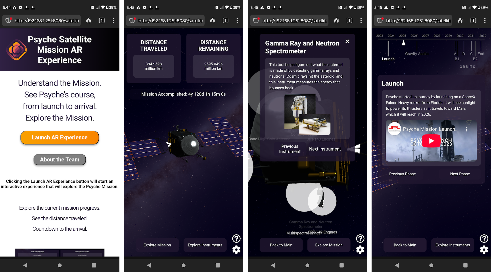

# Psyche Capstone - Iridium Class
Welcome to the iridium_18e_ar_xr-se team capstone project!

SER401/SER402 Group 30 - NASA Psyche Mission: AR/WebXR for Public Engagement

### Description:
The NASA Psyche Mission: AR/WebXR for Public Engagement aims to teach users about the NASA Psyche Mission through the use of augmented reality technology.
Users will connect to the different experiences using different QR codes.

So far there are two experiences:
- Satellite Experience: Teaches users about the Psyche Mission using a 3D simulation of the satellite in space. Includes data about mission phases and satellite instruments as well as real time mission data.
- Lore and Mythology Experience

### Student Members:
- Emily Dinaro
- Ryan Dinville
- Nicole Garcia
- Ryan McManamy
- Collin Miller

### Prerequisites
1. [Node.js](https://nodejs.org/en)
2. A modern web browser (Chrone, Firefox, Edge, etc.)

### Run Application
1. Clone the repository:
> git clone https://github.com/MissionToPsyche-Iridium/iridium_18e_ar_xr-se.git

2. Enter project directory:
> cd iridium_18e_ar_xr-se

3. Install Node HTTP server:
> npm install -g http-server

4. Run server:
> http-server.cmd

5. Connect to server in a browser using url:
> http://192.168.1.251:8080

# Satellite Experience

### Description
The goal Psyche Satellite Experience is to teach users about the different instruments on the Psyche mission satellite with an interactive model and how they are used in each phase of the mission. This experience also teaches users about the phases of the mission using an interactive timeline. This experience also includes real time mission data to inform the user the mission's current progress.

### Run Satellite Experience
1. Launch application using steps described above.
2. Navigate to satellite_experience/pages

### Libraries
- Three.js: Core 3D graphics library.
- OrbitControls: Enables camera movement.
- GLTFLoader: For loading models in GLB format.
- CSS2DRenderer: For adding 2D labels to scene.
- TextureLoader: For loading textures into scene.
- tween.js: For smooth animations.

### Experience Design
- The user will start at the experience launch page, this includes screenshots and a brief overview of the experience.

- From here the user can go to the about page which includes descriptions of the team members and citations for resources.

- The user may launch the experience using the launch button, this will bring them to the main page.

- The first thing the user will see is the help page, this will show a brief overview of controls and how to access other parts of the experience. Close this with the 'X' in the top right corner. The help page will reappear if the user is inactive for long enough.

- The main page includes real time mission data. At this point the user may access the help and settings buttons in the bottom right.
    * The settings page has options for 'Normal Mode', 'High Contrast Mode', 'Light Mode', & 'Color-blind Mode' for the styles of the elements. There is also a volume slider.

- Clicking 'Explore Instruments' takes the user to the instruments page. This will overlay several 'bubbles' on the satellite model with names.
    * Clicking on a bubble pulls up an instrument description window providing information about the instrument, the user can also explore instruments using 'Previous Instrument' and 'Next Instrument' in this window. Selecting an instrument should do a perform a short animation orienting the camera to face the instrument on the model.

- Clicking 'Explore Mission' takes the user to the mission page. This page shows a timeline of the mission at the top with a description of each mission phase below that.
    * From here the user can explore mission phases using 'Previous Phase' and 'Next Phase'.

### Software Design
#### HTML
HTML is located in '/satellite_experience/pages'.
- 'index.html' contains the html for the launch page including a launch button, an about page button, and information about the experience.

- 'about_page.html' contains the html for the about page including team member descriptions and citations.

- 'main_page.html' contains the html for the:
    * Settings/Help page buttons.
    * Settings/Help modal containers.
    * Main container for main content, instrument content, and mission content.
    * Navigation buttons to change main state (Main, Instrument, Mission).
    * Loading content for the loading page.
    * 3D scene element for THREE.js.

- 'help_modal.html' contains the html to be dynamically loaded for the help modal.

- 'settings_modal.html' contains the html to be dynamically loaded for the settings modal.

- 'main_content.html' contains the html to be dynamically loaded to the main container during the main state.

- 'instrument_content.html' contains the html to be dynamically loaded to the main container during the instrument state.

- 'mission_content.html' contains the html to be dynamically loaded to the main container during the mission state.

#### CSS
CSS is located in '/satellite_experience/assets/css'.
- 'index.css' contains the css for the launch page.

- 'about.css' contains the css for the about page.

- 'styles.css' contains the css for the experience in normal mode.

- 'high_contrast_mode.css' contains the css for the experience in high contrast mode.

- 'light_mode.css' contains the css for the experience in light mode.

- 'color_blind_mode.css' contains the css for the experience in color blind mode.

#### JavaScript
JavaScript is located in '/satellite_experience/assets/js'.
- 'index.js' contains the js for the launch page.

- 'app.js' contains the js for creating and initializing SFXManager, SpaceScene, HelpModal, SettingsModal, InstrumentContentManager, MissionContentManager, and MainStateManager.

- 'SFXManager.js' contains the class SFXManager which is responsible for loading audio, managing volume, playing ambient sound, and playing sound effects.

- 'SpaceScene.js' contains the class SpaceScene which is responsible for:
    * the loading screen logic.
    * Creating the camera.
    * Creating the scene.
    * Creating the lighting.
    * Creating the orbit controls.
    * Creating the skybox.
    * Loading the satellite model.
    * Creating and handling the timeline in the mission state.
    * Tracking the currently selected mission phase.
    * Creating and handling the bubbles in the instrument state.
    * Tracking the currently selected bubble.
    * Performing raycasting on the bubbles.
    * Animating camera movements when selecting instruments.
    * Rendering the scene.

- 'HelpModal.js' contains the class HelpModal which is responsible for:
    * The help icon button.
    * Loading help modal content.
    * Closing the help modal.
    * The help modal inactivity timer.

- 'SettingsModal.js' contains the class SettingsModal which is responsible for:
    * The settings icon button.
    * Loading settings modal content.
    * Closing the settings modal.
    * Setting the experience CSS style based on the mode chosen.
    * Adjusting the volume in the SFXManager based on the volume slider.

- 'InstrumentContentManager.js' contains the class InstrumentContentManager which is responsible for:
    * Updating instrument content based on bubbles selected by the SpaceScene.
    * Changing the selected instrument using the instrument transition buttons.
    * Closing the instrument popup.
    * Loading the instrument data from 'satellite_experience/assets/data/instruments.json'.

- 'MissionContentManager.js' contains the class MissionContentManager which is responsible for:
    * Updating mission content based on the current phase provided by the SpaceScene.
    * Changing the selected phase using the phase transition buttons.
    * Loading the phase data from 'satellite_experience/assets/data/phases.json'.

- 'MainStateManager.js' contains the class MainStateManager which is responsible for:
    * Switching the main state between 'main', 'mission' and 'instrument' based the navigation buttons.
    * Updating the button names based on the state.
    * Updating the current main state in SpaceScene.
    * Loading the content for the main state which includes calculating the mission time until completion and fetching data from 'satellite_experience/assets/xml/distance.xml' to get the mission distance data.

### Screenshots

